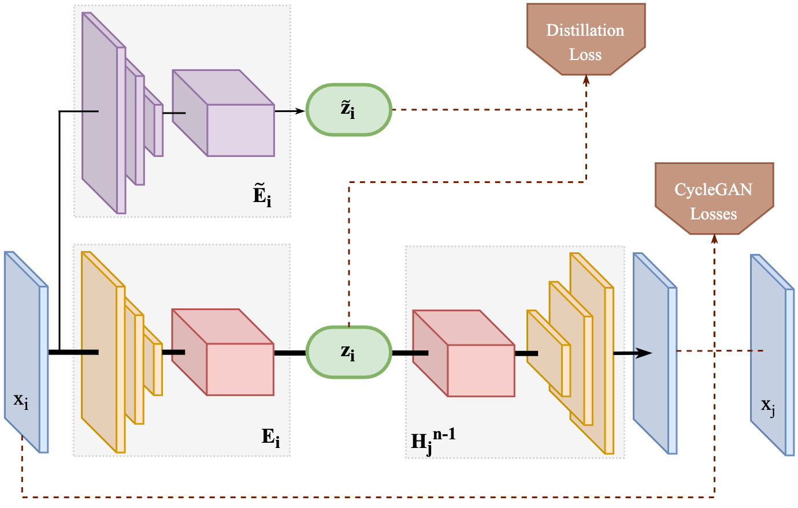
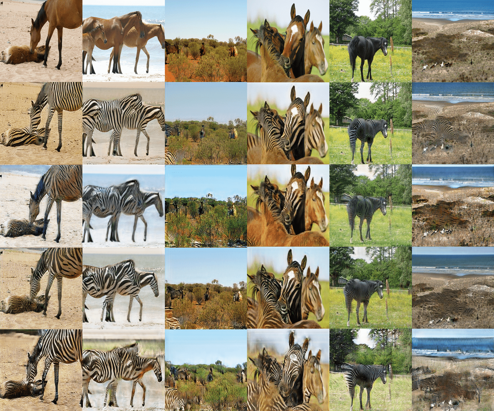

# Towards Lifelong Self-Supervision For Unpaired Image-to-Image Translation

This repo contains the **Pytorch** code for the paper [**Towards Lifelong Self-Supervision For Unpaired Image-to-Image Translation**]()



It is not very user-friendly (yet?) and some experimental tricks / comments will be lying around.

Its codebase comes from [CycleGAN's Pytorch repo](https://github.com/junyanz/pytorch-CycleGAN-and-pix2pix).

Main differences include the use of [`comet.ml`](https://comet.ml) to log experiments and `LiSS`-specific command-line arguments.

## Getting Started

These instructions will help you get the project up and running on your local machine using your own data.

### Prerequisites

Install library requirements from requirements.txt file
```
pip3 install -r requirements.txt 
```


### Data

The data should be structured as CycleGANs. Additionally, if you want to use `depth` as an auxiliary task, you need to have sub-folders `data/trainA/depths` (same for all other data folders) with inferences from [MegaDepth](https://github.com/zhengqili/MegaDepth).

[Here](https://drive.google.com/file/d/1vd7GrYSIJ6yV_yr4Xa3o1HV2cXe65tf7/view?usp=sharing) is a version of the Horse<>Zebra dataset **with depth**.

### LiSS Arguments

Compared to CycleGAN, `LiSS` uses [RAdam](https://github.com/jettify/pytorch-optimizer#radam) to optimize parameters and adds the following arguments (in `liss_mode.py`):

```python
parser.add_argument(
    "--lambda_CA",
    type=float,
    default=10.0,
    help="weight for cycle loss (A -> B -> A)",
)
parser.add_argument(
    "--lambda_CB",
    type=float,
    default=10.0,
    help="weight for cycle loss (B -> A -> B)",
)
parser.add_argument(
    "--lambda_DA",
    type=float,
    default=1.0,
    help="weight for Discriminator loss (A -> B -> A)",
)
parser.add_argument(
    "--lambda_DB",
    type=float,
    default=1.0,
    help="weight for Discriminator loss (B -> A -> B)",
)
parser.add_argument(
    "--lambda_R", type=float, default=1.0, help="weight for rotation"
)
parser.add_argument(
    "--lambda_J", type=float, default=1.0, help="weight for jigsaw"
)
parser.add_argument(
    "--lambda_D", type=float, default=1.0, help="weight for depth"
)
parser.add_argument(
    "--lambda_G", type=float, default=1.0, help="weight for gray"
)
parser.add_argument(
    "--lambda_DR",
    type=float,
    default=1.0,
    help="weight for rotation loss in discriminator (see SSGAN minimax)",
)
parser.add_argument(
    "--lambda_distillation",
    type=float,
    default=5.0,
    help="weight for distillation loss (when repr_mode == 'distillation')",
)
parser.add_argument(
    "--lambda_I",
    type=float,
    default=0.5,
    help="use identity mapping. Setting lambda_I other than 0 has an\
        effect of scaling the weight of the identity mapping loss. For \
        example, if the weight of the identity loss should be 10 times \
        smaller than the weight of the reconstruction loss, please set \
        lambda_I = 0.1",
)
parser.add_argument(
    "--task_schedule", type=str, default="parallel", help="Tasks schedule"
)
# sequential       :  <rotation> then <depth> then <translation>
#                     without the possibility to come back
#
# parallel         :  always <depth, rotation, translation>
#
# additional       :  <rotation> then <depth, rotation> then
#                     <depth, rotation, translation>
#
# liss             :  sequential with distillation
#
# representational :  <rotation, depth, identity> then <translation>
parser.add_argument(
    "--rotation_acc_threshold",
    type=float,
    default=0.2,
    help="minimal rotation classification loss to switch task",
)
parser.add_argument(
    "--jigsaw_acc_threshold",
    type=float,
    default=0.2,
    help="minimal jigsaw classification loss to switch task",
)
parser.add_argument(
    "--depth_loss_threshold",
    type=float,
    default=0.5,
    help="minimal depth estimation loss to switch task",
)
parser.add_argument(
    "--gray_loss_threshold",
    type=float,
    default=0.5,
    help="minimal gray loss to switch task",
)
parser.add_argument(
    "--i_loss_threshold",
    type=float,
    default=0.5,
    help="minimal identity loss to switch task (representational only)",
)
parser.add_argument(
    "--lr_rotation",
    type=float,
    default=0,
    help="minimal identity loss to switch task (representational only)",
)
parser.add_argument(
    "--lr_depth",
    type=float,
    default=0,
    help="minimal identity loss to switch task (representational only)",
)
parser.add_argument("--lr_gray", type=float, default=0)
parser.add_argument("--lr_jigsaw", type=float, default=0)
parser.add_argument(
    "--encoder_merge_ratio",
    type=float,
    default=1.0,
    help="Exp. moving average coefficient: ref = a * new + (1 - a) * old",
)
parser.add_argument(
    "--auxiliary_tasks", type=str, default="rotation, gray, depth, jigsaw"
)
parser.add_argument(
    "--D_rotation",
    action="store_true",
    default=False,
    help="use rotation self-supervision in discriminators when translating",
)
parser.add_argument(
    "--repr_mode",
    type=str,
    default="freeze",
    help="freeze | flow | distillation: When switching from representation "
    + "to traduction: either freeze the encoder or let gradients flow. "
    + "Set continual for flow + distillation loss",
)
```

### Generated Horse to Zebra

Comparison of models on the horse -> zebra dataset, with rows corresponding the image to translate (row 0) then translations from: CycleGAN (row 1), LiSS CycleGAN (row 2), Parallel Schedule (row 3), Sequential schedule(row 4). Note: the slight discrepancy in cropping is due to data-loading randomness.

## Code

If you want to understand the code in `liss_model.py`, you should follow the following *schedule*:

1. Training and validation procedures rely on the `AuxiliaryTasks` class to index, sort and parametrize tasks (see `--auxiliary_tasks` and `models/task.py`)
2. According to `train.py`, the typical update step calls are:
   1. `model.set_input(data)`
   2. `model.optimize_parameters()` which itself calls in order:
      1. `model.forward()`
      2. `model.backward_G()`
      3. `model.backward_D()`
3. We use `self.should_compute(task_key)` for the model to know which head/task should be trained / back-propped through at any time
4. Schedules are updated according to validation metrics with `model.update_task_schedule(metrics)` which is set by `model.init_schedule()`
   1. The reference encoder is updated in `model.update_ref_encoder()`
5. Each generator `netG_A` or `netG_B` has an `encoder` attribute and one head per task. `decoder` is the translation head so that `decoder(encoder(x))` is CycleGAN's default generator.
   1. Be careful with Pytorch's `nn.DataParallel` interface: to access `netG_A`'s `encoder` for instance you should do `netG_A.encoder` on `cpu` and single `gpu` but `netG_A.module.encoder` on a `nn.DataParallel` device (same goes for all other attributes and tensors).

## License

This project is licensed under the GNU License - see the [LICENSE.md](LICENSE.md) file for details